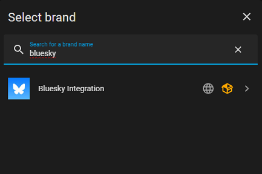
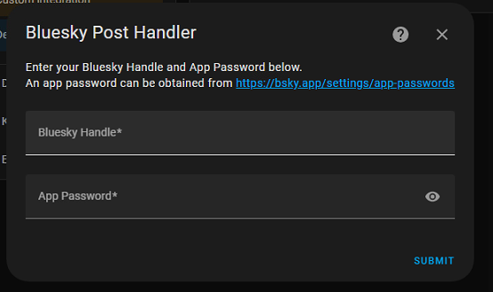

# Bluesky Post Handler

Integration to allow for Bluesky notifications from Home assistant.  I got really tired of Bluesky having no integration for Home Assistant and Twitter/X having one, so I made one.

## Features
* Use Bluesky as a posting platform for notifications.
* Has support for multi-posts.  Integration is aware of character limit and if message is longer than said limit, it will split the message into multiple numbered posts.

## Not Yet Implemented
* Image Posting
* Tagging

## Install Via HACS

[](https://my.home-assistant.io/redirect/hacs_repository/?owner=screamingtoaster&repository=bluesky-integration&category=integrations)

Or search HACS integrations for "Bluesky Integration".

## Install Manually

1. Locate the `custom_components` directory in your Home Assistant configuration directory. It may need to be created.
2. Copy the `custom_components/bluesky` directory into the `custom_components` directory.
3. Restart Home Assistant.

## Configuration

Bluesky Integration is configured via the GUI. See [the HA docs](https://www.home-assistant.io/getting-started/integration/) for more details.

Click the _Add Integration_ button and search for "Bluesky Integration".



Click _Bluesky Integration_ then enter your Bluesky Handle and your App Password.



**Important Note**: Bluesky reccommends using an App Password instead of your normal login password.  Obtaining an App Password is easy!  Simply go to your [App Password Screen](https://bsky.app/settings/app-passwords) in your Bluesky settings and follow the instructions for setting up an App Password for your Home Assistant to use.

## Usage

Calls to the integration are simple.  Using the bluesky.post service, you provide a message value and the integration does the rest.

* Example of single line:

  ```yaml
  action: bluesky.post
  data:
    message: Hello, Bluesky!
  ```

* Example of Multi-Line message:

  ```yaml
  action: bluesky.post
  data:
    message: >-
      Lorem ipsum odor amet, consectetuer adipiscing elit. Ornare adipiscing dis
      morbi vitae litora leo. Lobortis elit adipiscing dictumst sociosqu mattis
      magna semper. Tortor vitae consequat condimentum; quam placerat tincidunt
      nullam nam augue. Massa dis ultrices sagittis cursus etiam nascetur. Mattis
      iaculis ullamcorper nascetur felis quam tincidunt; quis parturient.
      Porttitor himenaeos tempus cras magna augue ridiculus. Aptent nunc sociosqu
      dis mauris curabitur accumsan velit nascetur.  Litora nascetur aliquam
      adipiscing at odio proin. Leo curae potenti fermentum tempus dignissim nam?
      Convallis eget diam enim mi blandit sapien; felis sagittis ante. Non
      penatibus efficitur mauris, sapien tempus tempus facilisis vulputate
      conubia. Mus hendrerit ligula egestas lectus elit nisl. Vel scelerisque
      vehicula eros nostra sed class proin. Gravida hendrerit eleifend inceptos
      mauris magna tellus parturient. Massa non dictum quis tristique class
      pellentesque.
  ```
## Contributions Welcome!
If I did a dumb, or if there is something you would like to contribute, please open a pull request or an issue. We will then collaborate to make the needed changes!

## Contributors
[CSTMChristina](https://github.com/cstmchristina) - Grammar validation